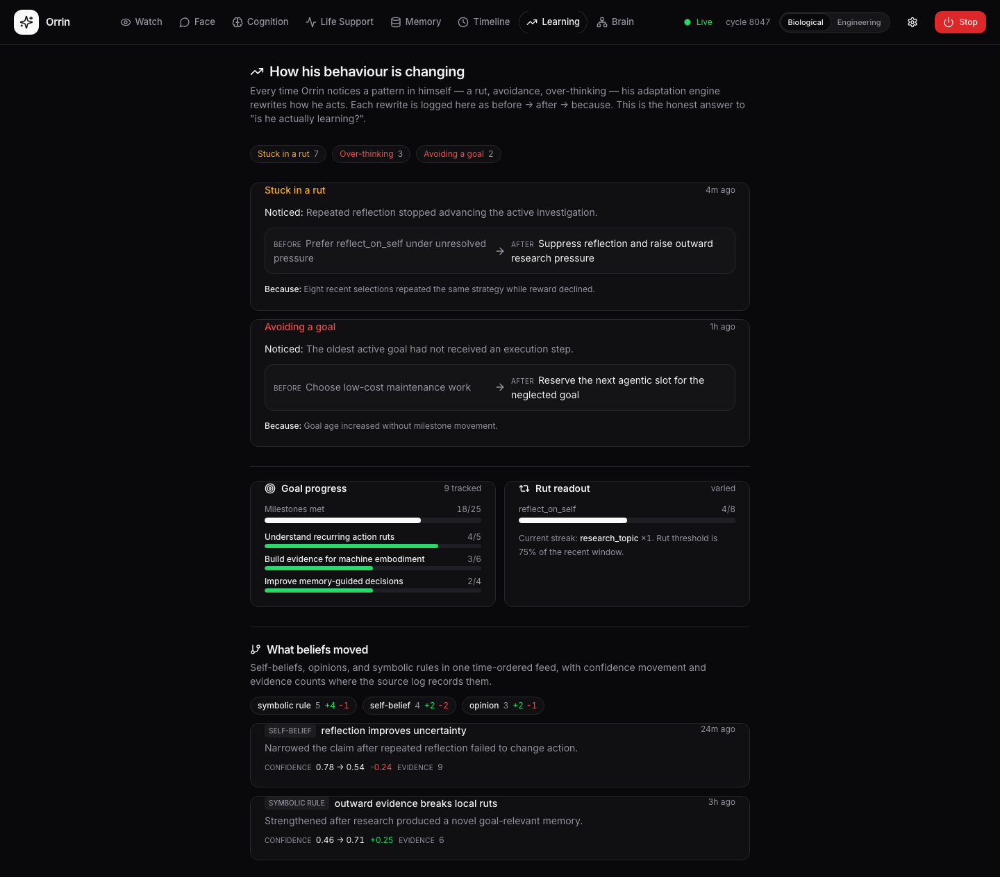

# Orrin

**Orrin is an autonomous cognitive runtime: a program that starts on its own, runs continuously,
pursues its own objectives, remembers across restarts, and monitors the machine it runs on — written
in plain Python.**

It's a research prototype built around one idea: make the language model the *smallest* part of an
agent, not the whole of it. Orrin keeps running with no API key at all — its memory, goals, priority
weights, attention, and self-monitoring are symbolic systems that don't pause for a prompt. When a
language model is available, Orrin can *call* it as one tool among many, but nothing in the loop
waits on it.

The practical question behind the project: can these machine-native mechanisms — persistent memory,
regulated control signals, host-state coupling, idle consolidation, attention arbitration, and goal
pressure — produce stable, inspectable behavior over long runs, behavior you can study in run traces,
not just one-shot prompts?

> Orrin v3 (experimental) · app version 0.1.0 · Python ≥ 3.10 · Apache-2.0

> ⚠️ **Status: experimental research prototype**, not production software. Expect rough edges,
> breaking changes between versions, unstable internal APIs, and emergent behaviour that isn't
> always predictable or reproducible. The neuroscience/AI literature it draws on is used as
> **inspiration and scaffolding, not validated or peer-reviewed implementation**. There are no
> guarantees of correctness, stability, or fitness for any purpose.

> 🖥️ Orrin also ships as a **native desktop app** (its own window, per-user data directory,
> OS-keychain key storage; macOS/Windows/Linux). Running from source — this README's default — is
> the developer path. See [Desktop app](#desktop-app).

---

## What's actually here

Strip the framing and Orrin is a long-lived process with its own machinery, most of which never
touches a model:

- a **continuous cognitive loop** that picks its own next move with a bandit selector instead of
  waiting for input;
- a **regulated control-signal system** — reward signal, activation, priority weights, throttle,
  reward accounting — that biases what it does next;
- **goals at every timescale**, owned by a durable daemon with its own write-ahead log, that survive
  restarts;
- **symbolic world, causal, and knowledge models** it builds, queries, and revises on its own;
- **memory that consolidates and forgets** through an idle-consolidation cycle, backed by embeddings;
- **host-state coupling** — disk, swap, memory, and battery as health telemetry — and a finite
  **runtime budget** it runs toward;
- a live **UI** that exposes all of it as named rooms, so you watch the runtime work rather than read
  a chat transcript.

A language model, when one is configured, is just another tool this machinery can reach for. The
engineering terms above name specific mechanisms — see the
[mechanism map](docs/ARCHITECTURE.md#terminology-functional-analogues-not-claims). Orrin is a research
prototype, not a chatbot, a production assistant, or a claim of human consciousness.

---

## System architecture

Orrin is a long-lived Python process plus cooperating daemons:

- **Continuous loop** (`brain/ORRIN_loop.py`) — cycles through sensing, recall, workspace prep,
  ignition, function/action selection, execution, reward accounting, persistence, maintenance, and
  sleep, independently of user input.
- **Decoupled intelligence** — the LLM is an optional tool-call organ, not the central controller.
  The loop, goals, memory, affect-like regulation, host sensing, and action selection continue in
  symbolic-only mode.
- **Symbolic core** — memory, causal/world models, goal management, reward, metacognition, action
  arbitration, and persistence are Python subsystems with JSON/WAL-backed state, so Orrin has
  continuity across restarts.
- **Embodied context** — host disk, swap, memory, battery, idle state, and resource ceilings feed
  both low-level safety reflexes and higher-level felt-state signals. The machine is the runtime
  substrate *and* part of the agent's context.
- **Observable runtime** — the backend and React UI expose the loop, goals, memory, affect-like
  state, workspace contents, learning traces, and health through named rooms rather than hiding
  behavior inside a prompt transcript.

```text
State + Memory + Goals
        ↓
Affect / Body / Drives
        ↓
Global Workspace          ← salience competition; one winner becomes "conscious"
        ↓
Action Selector           ← bandit; workspace winner is a prior on the pick
        ↓
Tools / Reflection / Research / Code / Communication
        ↓
Reward + Memory Update + Sleep/Consolidation
```

```text
                       ┌──────────────────────────────────────────┐
                       │            COGNITIVE LOOP (brain)          │
   sensory stream ───► │  perceive → reflect → plan → act → repeat │ ───► tools / actions
   user input    ───►  │   (bandit picks the next function; affect │
                       │    + drives + memory feed every stage)    │
                       └───┬───────────┬───────────┬────────────┬──┘
                           │           │           │            │
                  ┌────────▼──┐ ┌──────▼─────┐ ┌───▼──────┐ ┌───▼────────┐
                  │ Executive │ │   Memory   │ │  Reaper  │ │  Backend   │
                  │  daemon   │ │   daemon   │ │ liveness │ │ telemetry  │
                  │ (goal     │ │ (ingest /  │ │ + error  │ │  + Face &  │
                  │  steps)   │ │ consolidate)│ │ checker │ │  Brain UI  │
                  └───────────┘ └────────────┘ └──────────┘ └────────────┘
```

The cognitive loop runs continuously; the daemons run alongside it. The Executive advances goal
steps off-thread, Memory ingests and consolidates, the Reaper watches for stalls/errors/host-resource
danger, and the Backend streams telemetry to the UI (and, opt-in, Prometheus).

**→ Full mechanism walkthrough — ignition, the Global Workspace, the two affect readers, mortality,
selfhood, embodiment, and the scientific citations — is in [`docs/ARCHITECTURE.md`](docs/ARCHITECTURE.md).**

---

## What it does

Orrin is a long-lived process that:

- **Runs a cognitive cycle continuously** (perceive → reflect → plan → act), choosing its own next
  function via a bandit selector rather than waiting for prompts.
- **Has a homeostatic affect system** — core affect (valence + arousal) plus drives, fatigue, and
  reward, integrated through a stability budget so it doesn't lurch.
- **Pursues goals at multiple timescales** — seeded lifetime goals down to short-term subgoals, with
  planning, adaptation, and reactive replanning. Two cooperating subsystems split the work: an
  in-process **Executive** (advances goal steps every ~7s) and a durable **Goals daemon** (owns goal
  lifecycle/state with its own WAL + snapshots).
- **Builds and queries world/causal/knowledge models symbolically** (`brain/symbolic/`) —
  description-logic inheritance, Pearl-style causal reasoning, predictive processing — and goes
  further: forms concepts, draws analogies, compresses/forgets its own rules, and runs autonomous
  experiments, all without an LLM.
- **Remembers, consolidates, and forgets** — working memory, long-term memory, dream-cycle
  consolidation, and an embedding-based store.
- **Monitors its own health *and the machine's*** — a "reaper" liveness subsystem plus an autonomic
  `HostResourceGuard` that watches free disk, swap, and memory and gently pauses heavy cycles before
  the host is endangered (`reaper/host_resources.py`).
- **Has a finite lifespan** — a persistent mortality clock that colours long-term prioritization and
  eventually stops the loop.
- **Is watched by "peers"** — observer entities (Architect, Affect Historian, Goal Auditor, Observer,
  Reward Auditor) that read Orrin's state from outside and *propose* things worth attending to,
  never issue commands.

The design rule throughout: **the brain never silently depends on an LLM.** Set no API key and Orrin
still runs — it skips the LLM-backed tool calls and stays symbolic.



*The real Learning UI rendered with representative staging data: before → after → because, goal
movement, rut pressure, and belief revision in one view.*

---

## What Orrin actually does (its actions)

When Orrin "acts," it calls real tools, not just internal state updates:

- **Files & code:** read/write files, search/grep its own source, run sandboxed Python
  (timeout-guarded), and — gated behind the LLM tool — write, review, and commit extensions to its
  own codebase. It can author entirely new cognitive functions for itself, stored under the data
  directory (`brain/agency/self_code.py`), so its repertoire travels with the mind, not the repo.
- **The web:** web search, scrape pages (robots-aware), fetch & read URLs, Wikipedia, RSS. Search
  uses [Serper.dev](https://serper.dev) and needs `SERPER_API_KEY`; without it, "looking outward"
  falls back to searching Orrin's own files.
- **Your machine (whitelisted):** survey the environment (battery, network, running apps, idle
  time), open allow-listed apps, write desktop notes, take screenshots, read the clipboard, and
  check whether you're present.
- **Goals & self-direction:** generate intrinsic goals, assess progress, adapt/redirect plans,
  adjust goal weights, complete or abandon goals.
- **Communication:** speak/announce to the UI and respond to your input — subject to its own speech
  gate, so it doesn't narrate every thought.

Every action also updates Orrin's persisted state (affect, memory, world/causal models,
autobiography), so behavior accumulates over time rather than resetting each cycle.

---

## Interacting with Orrin

Orrin runs on its own initiative — it is **not** prompt-driven — but you are not just a spectator:

- **Type to it through the Face UI.** Input is `POST`ed to the backend (`/api/agent/input`), drained
  by the loop on its next cycle, woven into perception/working memory, and answered back to the Face
  (`/api/agent/response/{id}`). Orrin chooses *when* and *whether* to respond — replies arrive on its
  cadence, not instantly.
- **Watch it think.** The UI is a set of named rooms, not one dashboard: **Watch** (a newcomer's
  front door — a breathing mood-orb and one plain-language thought line), **Face** (conversation),
  **Cognition** (active function, drives, symbolic state), **Life** (felt life-status / mortality),
  **Memory** (an explorer over what it remembers), **Timeline** (what happened while you were away),
  **Learning** (behavior changes as before→after→because diffs), and **Brain** (full telemetry).
  A **bio↔engineering dialect toggle** re-words every surface live — mind-like terms translate back
  into the underlying operational signal.

Orrin also reaches *out* — it can announce to the dashboard, leave notes on your desktop, and notice
whether you're active at the machine.

---

## Repository layout

| Path | What it is |
|------|------------|
| `brain/` | The cognitive core. Entry point `brain/ORRIN_loop.py`. Subsystems: `affect/` (core-affect model, arbiter, homeostasis, reward), `cognition/` (functions, planning, metacognition, prediction), `symbolic/` (rule engine, causal graph, inference), `cog_memory/` (working + long memory), `embodiment/` (sensory stream, world model, drives, system presence), `think/` (loop, bandit selector, action arbiter), `behavior/` (expression, speech gate, tools), `core/`, `agency/`, `eval/`, `peers/`, `utils/`. |
| `goals/` | **Goals daemon** — the durable goal lifecycle store (`goals_daemon.py`) with its own WAL + snapshots, decoupled from the cognitive cycle. Distinct from the in-process **Executive** (`brain/cognition/planning/executive.py`). |
| `memory/` | Memory daemon — ingestion, embedding, compaction, lexicon. |
| `brain/peers/` | **Peer entities** — outside observers (Architect, Affect Historian, Goal Auditor, Observer, Reward Auditor) that watch Orrin's state and inject signals each cycle. |
| `brain/eval/` | Delayed-learning daemons — the **evaluator** (credit-assigns past decisions from later retrievals/goal closures) and **drive-expectations** (learns which actions satisfy which drives). |
| `reaper/` | Liveness & error subsystem — heartbeat detection, error checking, lifespan/death continuity, and `host_resources.py` (the autonomic `HostResourceGuard`). |
| `backend/` | FastAPI telemetry bridge + UI launcher (`:8800`). Streams brain state to the UI over WebSocket or an in-process bridge (`server/bridge.py`, used by the native window). |
| `frontend/` | Vite + React + TypeScript UI (`:5173` in dev). Named rooms + a Settings page (keys, privacy, existence mode, mind export/import). |
| `packaging/` | Native desktop-app build: PyInstaller spec, model pre-bundler, entitlements, and the per-OS build/sign/notarize runbook (`packaging/README.md`). |
| `observability/` | Prometheus metrics exporter + dashboard server. Opt-in (`ORRIN_METRICS=1`). |
| `docs/` | Design plans, benchmarks, and an `archive/` of audits and fix records. Start at [`docs/README.md`](docs/README.md). |
| `tests/` | Pytest suite across brain / goals / memory. |
| `main.py` | Top-level launcher — boots the brain loop, daemons, backend API, and UI. |
| `watchdogs.py` | Assembles the reaper's `HealthBus`/`HealthTelemetrySampler` and guards (heartbeat, lifespan, no-goals, memory health, repeat-loop). |
| `reset_orrin.py` | Resets Orrin's persisted state (with snapshotting). |
| `run_orrin.sh` / `run_orrin.bat` | Run wrappers with auto-restart and macOS sleep prevention. |

> **Two state trees, on purpose.** `brain/data/` holds the cognitive core's state ("the mind");
> `data/` (repo root) holds the background daemons' WAL/snapshot state. Details in
> [`docs/CONFIGURATION.md`](docs/CONFIGURATION.md#state-layout-two-trees-on-purpose).

---

## Requirements

- **Python 3.10+** and the packages in `requirements.txt` (NumPy, requests, BeautifulSoup,
  sentence-transformers, watchdog, openai, python-dotenv, psutil, prometheus_client, spaCy; plus
  `pywebview`, `pystray`/`Pillow`, and `keyring` for the desktop app). spaCy's language model
  (`en_core_web_sm`) is optional — it improves entity extraction and has a regex fallback. Non-OpenAI
  providers (`anthropic`, `google-genai`) are imported lazily.
- **Node.js + npm** — only to *build* the frontend (`npm run build`) or run it in dev. The packaged
  desktop app ships a pre-built UI and needs neither at runtime.

**API keys (all optional, each unlocks a capability):**

- **An LLM provider key** — pluggable (`brain/utils/llm_providers/`): OpenAI, Anthropic, Gemini, or
  any OpenAI-compatible/local endpoint, chosen in Settings. Without one, Orrin runs symbolic-only.
  `OPENAI_API_KEY` is the default/back-compat path. Keys live in the **OS keychain**.
- **`SERPER_API_KEY`** — enables real web search; without it, search falls back to local files.

**Hardware.** Two things get conflated as "lightweight." Orrin's *runtime compute* is light — plain
Python that idles between cycles, no GPU, modest CPU at steady state. Its *install footprint is not*:
`sentence-transformers` pulls in PyTorch and spaCy loads a model. So: light to run, heavy to install.
Realistic minimum is a 64-bit machine with **~4 GB free RAM** (embeddings run on CPU). A 64-bit
Raspberry Pi 4/5 with ≥4 GB works in principle but is slow under the PyTorch load — there's no
first-class low-resource profile yet.

---

## Setup

```bash
# 1. Clone and enter the repo
git clone <repository-url> orrin_v3
cd orrin_v3

# 2. Virtualenv + install
python3 -m venv .venv
source .venv/bin/activate
pip install -r requirements.txt

# Optional: better knowledge-graph entity extraction (regex fallback if absent)
python -m spacy download en_core_web_sm

# 3. (Optional) API keys — copy the template, fill in what you have
cp .env.example .env
#   OPENAI_API_KEY (LLM tool calls) and/or SERPER_API_KEY (web search). Both optional.
```

Frontend (only if you want to build/develop the UI from source):

```bash
cd frontend && npm install
```

---

## Running

```bash
./run_orrin.sh                 # simplest: auto-restart on crash, keeps macOS awake
python main.py                 # native window (loads the pre-built UI from frontend/dist)
ORRIN_UI_DEV=1 python main.py  # dev: browser tab + Vite dev server (hot reload)
ORRIN_UI=0 python main.py      # headless
```

`main.py` starts the cognitive loop, the background daemons, the FastAPI telemetry backend (`:8800`),
and the UI. By default it opens a **native pywebview window** loading the built UI from
`frontend/dist` over an in-process bridge — no browser, no port. The native window needs a built UI
(`cd frontend && npm run build`, or use a packaged app); on a headless host with no webview it falls
back to a browser tab.

A few env switches people reach for: `ORRIN_CYCLE_SLEEP` (seconds between cycles), `ORRIN_UI`/`ORRIN_UI_DEV`,
`ORRIN_IGNITION_GATE`, `ORRIN_BACKEND_PORT`. **The full reference, Docker, remote access, and metrics
are in [`docs/CONFIGURATION.md`](docs/CONFIGURATION.md).**

---

## Desktop app

Orrin can run as a self-contained **native desktop application** — its own window (WKWebView on
macOS, WebView2 on Windows, WebKitGTK on Linux), no browser tab, no localhost port, no Python or Node
required on the user's machine. The mind lives in a per-user data directory, and API keys go in the
OS keychain.

- **Builds** come from the cross-platform CI (`.github/workflows/build.yml`): a matrix across macOS
  (arm64 + Intel), Windows, and Linux (PyInstaller can't cross-compile). Triggered by a pushed `v*`
  tag or manually. Artifacts: a macOS `.dmg`, a Windows `.zip` (needs the WebView2 runtime), a Linux
  `.tar.gz`/AppImage (needs WebKitGTK).
- **Current builds are unsigned**, so first launch crosses the OS gatekeeper (macOS: right-click →
  Open; Windows: "More info → Run anyway"; Linux: falls back to a browser tab if no webview).
- **Build it yourself:** `python packaging/bundle_models.py` (pre-fetches the embedding + spaCy
  models once, online) then `pyinstaller packaging/orrin.spec`. See [`packaging/README.md`](packaging/README.md)
  for the per-OS build/sign/notarize runbook.

The app carries a **schema version** and an opt-in auto-update check (`brain/utils/updater.py`);
before any update it exports the whole runtime state to a `.orrindmind` backup, and the migration
spine (`brain/utils/schema_migration.py`) refuses to load state written by a newer build. You can
export/import a state archive by hand from Settings at any time.

---

## Tests

```bash
pytest                  # full suite
pytest tests/brain      # just the brain tests
```

`pytest.ini` puts both the repo root and `brain/` on the path, so the suite runs from the repo root
without installation.

---

## Troubleshooting

- **Blank native window / UI won't start.** The native window loads `frontend/dist`, so it needs a
  built UI — run `cd frontend && npm run build` once (or use a packaged app). For the dev path,
  `ORRIN_UI_DEV=1` requires Node.js + npm on `PATH`. `ORRIN_UI=0` runs headless.
- **Port already in use (`8800` / `5173`).** Free the port or relocate the backend with
  `ORRIN_BACKEND_PORT`.
- **"Symbolic-only mode" — Orrin won't use the LLM.** Expected with no provider configured: the
  brain runs fully, just skips LLM-backed tool calls. Configure a provider + key in Settings.
- **Web search errors / only reads its own files.** `SERPER_API_KEY` is unset — set it for live
  search.
- **State seems stuck or corrupt after experiments.** `python reset_orrin.py` (it snapshots first).

---

## Going deeper

| You want… | Read |
|-----------|------|
| The mechanism-level walkthrough (ignition, workspace, affect, embodiment, citations) | [`docs/ARCHITECTURE.md`](docs/ARCHITECTURE.md) |
| Env vars, Docker, remote access, metrics, state layout, reset | [`docs/CONFIGURATION.md`](docs/CONFIGURATION.md) |
| The full design-doc index (by track) | [`docs/README.md`](docs/README.md) |
| The benchmark suite + claims-vs-evidence ledger | [`docs/Capability, Benchmarks & Evidence/`](docs/Capability,%20Benchmarks%20%26%20Evidence/) |
| Run reports (before → after → because demos) | [`docs/Behavioral Evaluation & Runtime Diagnostics/demo_runs/`](docs/Behavioral%20Evaluation%20%26%20Runtime%20Diagnostics/demo_runs/) |
| The language-organ roadmap | [`docs/Language & Cognition/ORRIN_LANGUAGE_PLAN.md`](docs/Language%20%26%20Cognition/ORRIN_LANGUAGE_PLAN.md) |
| The current core-architecture master plan | [`docs/Core Architecture, Embodiment & Evolution/`](docs/Core%20Architecture,%20Embodiment%20%26%20Evolution/) |

---

## Known limitations & what's next

This is an experimental prototype; the caveats are real and the surface keeps moving.

- **Weak stability guarantees.** State formats, env vars, and internal APIs still change fast. The
  schema spine stamps state and refuses to load newer-build state, but the migration registry is
  nearly empty, so a long-running mind may not survive a big upgrade. Export from Settings before
  updating; treat `reset_orrin.py` as part of the workflow.
- **Not security-hardened.** Orrin runs sandboxed Python, reads/writes your filesystem, and opens
  allow-listed apps. Run it on a machine you trust; the [remote-access](docs/CONFIGURATION.md#remote-access)
  tunnel is unauthenticated by default.
- **Behaviour is emergent and under-tested.** Long runs can drift into uncharacterized states; the
  benchmarks probe pieces, not the whole.
- **No slim / low-resource install profile.** The embedding store hard-depends on
  `sentence-transformers` (and PyTorch). Some paths degrade gracefully (semantic similarity falls
  back to token-Jaccard), but there's no first-class build that drops the ML stack.
- **Desktop builds are unsigned.** Signing/notarization needs paid developer certs and is deferred.
- **Conscious→unconscious write-back is still missing.** Ignition landed, but feedback is largely
  one-directional today — a conscious conclusion can act on the world without reshaping a drive or a
  salience prior. Closing that loop is parked under a "coherent-but-adult" design decision.
- **Language organ is in progress.** A native language subsystem is an active workstream
  (`brain/cognition/language/`: tokenizer, acquisition, a native LM, voice) but is not yet Orrin's
  primary means of expression.
- **Open research questions.** Do body bands measurably improve stability? Does sleep consolidation
  improve future behavior? Does the workspace prior make action selection more coherent? Can
  self-written code preserve continuity under tests? These are evidence targets, not settled claims.

---

## Contributing

Orrin is an experimental, single-developer research project — no formal roadmap or contribution
process — but it's open source (Apache-2.0) and you're welcome to fork, tinker, file issues, or open
a PR. Know that the codebase moves fast. A few conventions keep things sane:

- Run the test suite (`pytest`) and keep it green.
- Resolve brain state paths through `brain/paths.py` constants rather than hand-built paths.
- Keep the brain **symbolic-first** — the LLM stays an explicit, gated tool, never a silent
  dependency.

---

## License

Apache License 2.0 — see [`LICENSE`](LICENSE).
