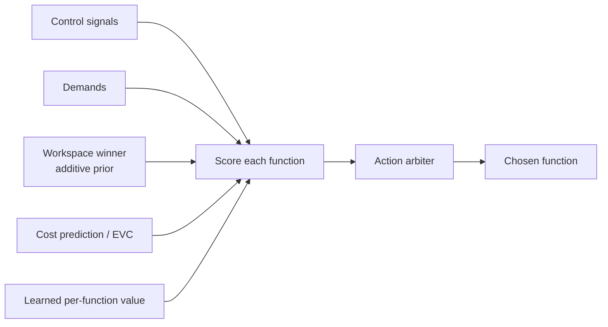

# Action Selection & Bandit Learning

Every cycle, Orrin chooses one cognitive function to run. That choice is a **contextual bandit** —
each arm is a function — biased by control signals, demands, the workspace winner, and predicted
cost. It's the point where affect, goals, and learned value converge into a single pick.

## The pick

- **Bandit selector** (`select_function.py`) — scores functions from learned value plus the biases
  above, then draws. It honors an explicit learning rate (constant-step), with a modulated adaptive
  rate available.
- **Workspace prior** (`ORRIN_WORKSPACE_PRIOR`) — the broadcast winner is an additive prior, so
  "what's in mind" biases "what gets done."
- **Cost prediction / EVC** (`cost_prediction.py`) — an expected-value-of-control layer: a
  function's predicted cost (time, tokens, energy) competes with its predicted payoff, so expensive
  functions must be worth it.
- **Action arbiter** (`action_arbiter.py`) — resolves reactive vs. analytical proposals so nothing
  races on shared state.

## Guardrails against ruts

Anti-repeat penalties, a meta-rut breaker, and outcome-devaluation keep a mediocre function from
monopolizing cycles; the **Reward Auditor** peer flags a reward signal that has collapsed to noise.

## Learning

Immediate reward updates the bandit each cycle; delayed credit arrives later from the evaluator
daemons. Reward itself is grounded in the [effect ledger](Production_and_Effect_Ledger). See
[Learning and Adaptation](Learning_and_Adaptation) and
[Thinking / Action Selection](Thinking_Action_Selection) for the deep dive.

## Code pointers

- `brain/think/think_utils/select_function.py`, `brain/think/bandit/`
- `brain/think/action_arbiter.py`, `brain/cognition/cost_prediction.py`
