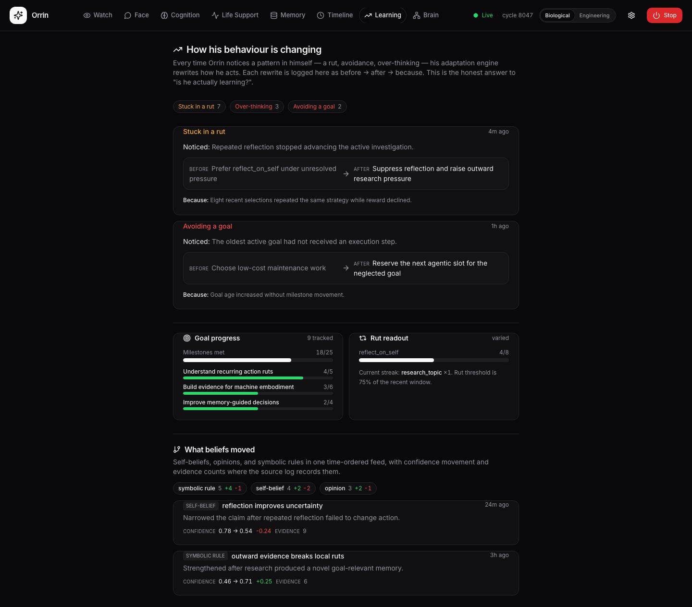

# Face & Brain UI

`frontend/` is a Vite + React + TypeScript app that exposes the runtime as named **rooms** instead
of hiding behavior in a chat transcript. It reads the telemetry stream from `backend/` (see
[Backend & Telemetry](Backend_Telemetry)); in the packaged desktop app it runs in a native
pywebview window over an in-process bridge with no open port.

## The rooms (`frontend/src/pages/`)

| Room | What it shows |
|------|---------------|
| **Face** | The person-facing surface: conversation and expressions composed through the [expression membrane](Expression_Membrane) |
| **Brain** | The live internals: workspace/thought stream, control-signal rings, demands, attention, goals, internal state |
| **Cognition** | Function-selection stats, per-function EMAs, thinking cost (tokens/cache), deliberation activity |
| **Memory** | The memory inspector: working memory, long-term retrievals, consolidation activity |
| **Learning** | Behavior changes and belief revisions as before→after→because diffs |
| **Life** | The existence view: runtime-lifetime phase, restoration, and run history |
| **Timeline** | The event timeline across the run |
| **Watch** | A passive observation screen built around the live thought line |
| **Voice** | The transcript: only Orrin's own utterances, verbatim, newest first (see below) |
| **Settings** | Provider/API-key management (keys go to the OS keychain), RAM budget, runtime options |

## Two different lines: the status label and the transcript

These are easy to confuse and are not the same thing.

The Watch/Face **thought line** is a *UI-authored status label*. `frontend/src/lib/thoughts.ts`
(sibling to `lexicon.ts`) maps the reported `active_fn` to a phrase a developer wrote —
`generate_intrinsic_goals` → "surfacing self-set goals from drives", and a companion-register
rewrite of the same act that only `/orrin` renders. Nothing in the runtime ever said it. It follows
the same hard rule as `lexicon.ts`: **translate the chrome, never the mind.**

The **Voice room** (`/voice`) is the other half of that rule — the mind, untranslated. It renders
the `voice` telemetry field, fed by `brain/cognition/voice.py`, which only accepts utterances from
call sites that already hold first-person content:

| Kind | Source |
|------|--------|
| `felt` | the global-workspace winner when it is a felt state ("a strong sense of being stuck") |
| `prediction` | an introspection miss — felt yes, behaved no |
| `intent` | the goal he just committed to, in its own words |
| `closeout` | a question closed by epistemic close-out (`brain/cognition/epistemic_closeout.py`), answered or not |
| `speech` | anything composed and delivered through the [expression membrane](Expression_Membrane) |
| `final` | last words, written once at the end of a life |

`voice.py` **never composes** — it veils (the [felt lexicon](Expression_Membrane) membrane, so a
raw signal identifier never reaches the transcript), drops anything still carrying backend markers
rather than cleaning it up, suppresses consecutive repeats, and records. The stitched narrative
composer is deliberately **not** a source: its prose is working-memory strings read back as content
(the self-echo family), so it would broadcast that bug as speech.

The transcript keeps its own append-only file (`voice_transcript.jsonl`), so `private_thoughts.txt`
— which interleaves his lines with the runtime's third-person narration at roughly one to fifty —
is no longer the only place his own words exist.

## Panels

`frontend/src/components/brain/` holds the panel library: control-signal rings, demands, attention,
goals + goal health, internal state, memory inspector, learning, language, predictions,
relationships, self-model, symbolic-model, tensions, resource signs, live console, and the
cognitive-sphere visualization.

## Type safety across the wire

The telemetry schema is defined once in `backend/server/schema.py`; `generate_telemetry_ts.py`
generates the frontend's TypeScript types from it (`make telemetry-types`), so the two sides cannot
silently drift.

## Modes

- **Native window** (default): pywebview over the built `frontend/dist`, no browser, no port.
- **Developer** (`ORRIN_UI_DEV=1`): Vite dev server on `:5173` with hot reload, backend on `:8800`.
- **Headless** (`ORRIN_UI=0`): no UI at all.
