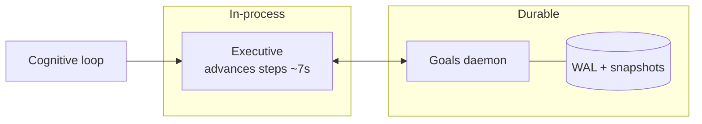

# Goals: Executive vs. Goals Daemon

Orrin splits goal responsibility across two cooperating subsystems: an in-loop **Executive** that
advances steps fast, and a durable **Goals daemon** that owns lifecycle and state. The split keeps
step-by-step progress responsive without risking durable goal state to a crash mid-cycle.

## Executive (fast, in-process)

`brain/cognition/planning/executive.py` — advances goal *steps* every ~7s inside the loop
(`ORRIN_EXECUTIVE_DAEMON_INTERVAL`). It handles generic, no-concrete-handler work that the daemon
deliberately parks.

## Goals daemon (durable, separate)

`goals/goals_daemon.py` — owns goal *lifecycle and state* with its own write-ahead log and
snapshots (`data/goals/`), decoupled from the cognitive cycle. Step attempts are persisted durably,
so a restart cannot silently reset progress or desync the daemon from the brain's view of a goal.

## Lifecycle

Goals span timescales — seeded lifetime **aspirations** down to short-term subgoals — with plan
adaptation (surgical subgoal reshaping) and reactive replanning when a capability fails mid-pursuit.
Two things make closure honest:

- **Aspirations are fail-able** — long-horizon goals carry guards, so a goal that stops producing is
  failed and replaced rather than absorbing attention forever.
- **Closure grounds on the [effect ledger](Production_and_Effect_Ledger)** (`has_qualifying_effect`),
  not on self-report — a goal can't claim completion without a qualifying recorded effect.

## Design notes

Keep goals small and measurable; explicit success criteria make outcome learning reliable. For the
durability machinery and handler registration, see [Goals Daemon Subsystem](Goals_Daemon_Subsystem).

## Code pointers

- `brain/cognition/planning/executive.py` — the in-loop step advancer
- `goals/goals_daemon.py`, `goals/runner.py`, `goals/store.py`, `goals/wal.py`
