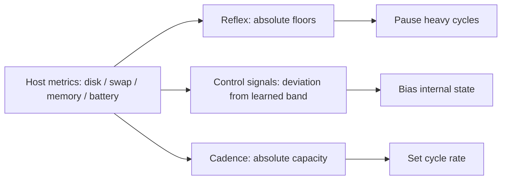

# Host Coupling

Orrin treats the machine it runs on as part of its runtime context and learns that machine's normal
behavior. The key idea: the **same host metrics feed three deliberately separate mappings**, so a
small or busy machine is not mistaken for chronic distress.

## The three mappings

1. **Reflex (absolute floors).** The autonomic `HostResourceGuard` (`supervisor/host_resources.py`)
   watches disk/swap/memory below cognition and pauses heavy cycles at absolute safety floors —
   separate from the deliberative loop, because a thrashing loop can't be asked to rescue the
   substrate it runs on.
2. **Control signals (deviation from a learned band).** The resource self-monitoring layer feeds the
   same metrics into internal state on **deviation** — falling disk reads as constriction, rising
   swap as slowdown, a draining battery as a finite-horizon signal.
3. **Cadence (absolute capacity).** A small machine simply runs at a **slower cadence**, not a
   degraded one (`resource_cadence.py`).

## Calibration and budget

`brain/cognition/infancy.py` learns *that machine's* normal oscillation before the runtime trusts
its own deviation signals. A user-facing RAM budget slider (`host_budget.py`) feeds both the cadence
policy and the reported "100%".

For the watchdogs and supervisor side, see [Host Coupling & Supervisor](Host_Coupling_Supervisor).

## Code pointers

- `supervisor/host_resources.py` — the reflex guard
- `brain/cognition/host_resource_monitor.py`, `host_band.py`, `resource_cadence.py`, `infancy.py`,
  `host_budget.py`
