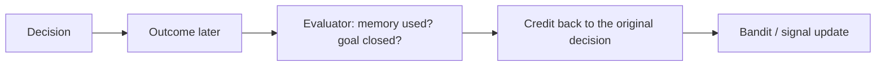

# Learning & Adaptation

Learning in Orrin is not one algorithm — it's several mechanisms, each learning independently from
the reward signal, some immediately and some with delay. The UI's **Learning** room surfaces the
result as before→after→because diffs.

## Immediate learning

- **Function selector** — the main contextual bandit that picks the next cognitive function; updates
  from immediate reward each cycle.
- **`depth_bandit`** (UCB1) — learns how many draft→critique→revise rounds the inner loop should run.
- **`thinking_depth`** — chooses shallow vs. deep reasoning chains for goal pursuit.

## Delayed learning (credit that can't be scored at action time)

- **Evaluator** (`brain/eval/`) — rewards a past decision when a memory it tagged is retrieved
  within ~50 cycles, or its goal closes within ~200. This is how "storing the right memory" or
  "setting up a good goal" eventually pays.
- **Demand-expectations** — learns which actions actually relieve which demands and routes that
  prediction error back into the control signals.

## Value authority: learning steers what runs *and* what's committed to

Learned outcome value doesn't just tune the bandit's internals — it has explicit authority over
both halves of behavior:

- **Selection** — `brain/think/think_utils/selection/score_actions.py` adds each action's learned reward EMA
  as an additive term in candidate scoring (with a cap on the exploration group), so an action
  whose realized reward has collapsed stops winning on priors alone.
- **Commitment** — `brain/cognition/planning/commitment_value.py` scores which goal holds the
  driver slot: base tier/priority, **plus** a credited-effect value EMA, **minus** staleness
  (driver cycles without a credited effect) and avoidance-streak penalties. A committed-but-unacted
  goal loses rank and rotates out; once released, its penalties decay so it can recover when it's
  actionable again. The survival-tier floor is preserved — the learned adjustment can cross
  priority ranks but never a tier boundary. Per-goal signals persist in
  `brain/data/commitment_signals.json`.

## Grounded reward

Reward is denominated in **durable outward effects**, not internal churn, via the
[effect ledger](Production_and_Effect_Ledger) — so learning pushes toward producing things, not just
thinking about them. Quality is gated by the [Quality Standard](Quality_Standard).

## Optional self-shaping (OpenAI-only)

`brain/cognition/finetuning/finetune_pipeline.py` filters traces with outcome ≥ 0.65, submits a
fine-tune job, and repoints `model_config.json` on completion so generation drifts toward what has
worked. Symbolic-only mode never touches it.

## Code pointers

- `brain/think/think_utils/select_function.py`, `brain/think/depth_bandit.py`
- `brain/eval/` — delayed-learning daemons
- See also [Action Selection and Bandit](Action_Selection_and_Bandit)
