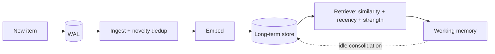

# Memory System

Memory is split between fast **working memory** the loop thinks with (`brain/cog_memory/`) and a
durable **memory daemon** (`memory/`) that owns long-term storage with its own write-ahead log. The
organizing principle: memory **forgets on purpose** — it consolidates, decays, and prunes rather
than growing without bound.

## Lifecycle

- **Ingest** (`ingest.py`) normalizes items; `novelty.py` dedupes near-duplicates on entry.
- **Embed** (`embedder.py`) — MiniLM / mpnet sentence embeddings (offline-capable).
- **Retrieve** (`retrieval.py`) — semantic similarity first, weighted by recency and per-memory
  **strength** (`strength.py`), which rises with use and decays without it.
- **Consolidate** — during idle cycles, working-memory items worth keeping are summarized and moved
  to long-term memory; long-term memory is replayed and decayed.

## Durability and bounds

Writes are durable in the WAL (`data/memory/wal/`) before they are indexed; `compaction.py` keeps
the store compact. Working memory is fixed-size, and append-only logs are capped. A multi-day run
should not need a reset for size reasons.

Retrieval quality is itself a learning signal: the delayed evaluator rewards the decision that
stored a memory when that memory is later retrieved and used (see
[Learning and Adaptation](Learning_and_Adaptation)).

For the module-level map and diagnosis, see [Memory System Subsystem](Memory_System_Subsystem) and
[Debugging Memory Issues](Debugging_Memory_Issues).

## Code pointers

- `memory/memory_daemon.py`, `memory/wal.py`, `memory/retrieval.py`, `memory/strength.py`
- `brain/cog_memory/` — working memory
