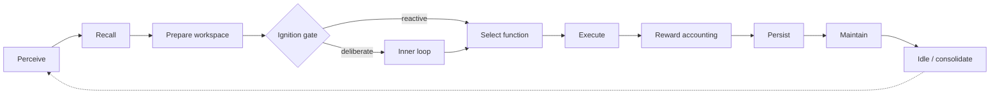

# The Cognitive Loop

`brain/ORRIN_loop.py` is Orrin's heartbeat: a continuous cycle that runs independent of user input.
Every stage is symbolic and runs with no LLM configured; the LLM is only ever an optional tool a
cycle may choose to call.

## The stages

1. **Perceive** — gather inputs: filesystem changes, UI events, host telemetry, incoming messages.
2. **Recall** — retrieve relevant memories (embedding similarity + recency + strength weighting).
3. **Prepare workspace** — subsystems propose candidate contents; binding composes unified
   situations (see [Binding and Workspace Writeback](Binding_and_Workspace_Writeback)).
4. **Ignition** — the deliberation gate decides whether this cycle crosses into full deliberation or
   stays in low-power reactive mode (see [Workspace and Ignition](Workspace_and_Ignition)).
5. **Select function/action** — a contextual bandit picks the next cognitive function, biased by
   control signals, demands, cost predictions, and the workspace winner.
6. **Execute** — run the function; produce effects and artifacts (recorded on the
   [effect ledger](Production_and_Effect_Ledger)).
7. **Reward accounting** — assign immediate reward now and queue delayed credit for later
   ([Learning and Adaptation](Learning_and_Adaptation)).
8. **Persist** — write durable state and WAL checkpoints.
9. **Maintain** — health checks and housekeeping.
10. **Idle / consolidate** — at a low-power cadence, consolidate memory, replay, and account for
    closed time.

## Cooperating daemons

The loop runs alongside off-thread daemons: the **Executive** advances goal steps (~7s), the
**memory daemon** ingests/embeds/consolidates, the **supervisor** watches liveness and host
resources, and the **backend** streams telemetry to the UI. See
[Goals: Executive vs. Daemon](Goals_Executive_vs_Daemon) and [Host Coupling](Host_Coupling).

## The design rule

**The brain never silently depends on an LLM.** With no provider key configured, Orrin runs fully
and simply skips LLM-backed tool calls. A non-ignited cycle stays cheap: the selector damps
effortful functions (planning, codegen, research) so quiet time drifts toward low-cost work.

## Tuning

- `ORRIN_CYCLE_SLEEP` — seconds between cycles.
- `ORRIN_IGNITION_GATE`, `ORRIN_WORKSPACE_PRIOR`, `ORRIN_CONFLICT_RECRUIT` — the ignition/workspace
  couplings (all default on, fail-safe). See the [Configuration Reference](Configuration_Reference).

## Code pointers

- `brain/ORRIN_loop.py`, `brain/loop/` — the loop and its phases
- [Loop Phases: Detailed](Loop_Phases_Detailed) — a stage-by-stage walkthrough
