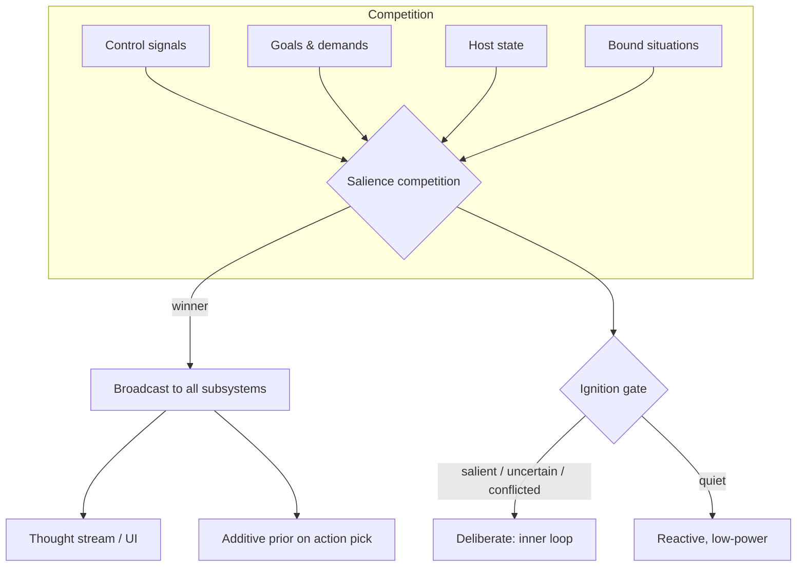

# Workspace & Ignition

Orrin's "consciousness bottleneck": every cycle, parallel subsystems compete to place content in a
**global workspace** (Baars 1988 / Dehaene 2014). One winner crosses the bottleneck, is **broadcast**
back to every subsystem, and becomes the live thought you see in the UI. Separately, an **ignition
gate** decides whether the cycle spends the energy on deliberate reasoning.

## The global workspace

Subsystems propose candidate contents that compete on salience
(`brain/cognition/global_workspace.py`). The winner crosses a single bottleneck and is broadcast
into context for the next cycle. **Hysteresis** keeps a salient content in focus across cycles, so
the thought stream is continuous rather than flickering. The stream is the *output of this
bottleneck*, not a log.

## The ignition gate

The background substrate — control signals, host coupling, demands, the workspace competition —
runs every cycle regardless. The gate (`should_think()`, `brain/think/deliberation_gate.py`) then
decides whether to cross into full deliberation. User input, high uncertainty, a strong signal, a
control-signal spike, prediction error, goal drift, or stagnation all ignite it; a periodic floor
(`MAX_SILENT_CYCLES`) guarantees it never stays silent too long.

## Three couplings that keep it coherent

- **Workspace prior** (`ORRIN_WORKSPACE_PRIOR`) — the broadcast winner is an additive prior on the
  action pick, so what's "in mind" and what gets done are one bottleneck, not two.
- **Conflict recruitment** (`ORRIN_CONFLICT_RECRUIT`) — System-2 deliberation is recruited by
  workspace *conflict*, not fired on a schedule (Botvinick et al. 2001).
- **Decaying writeback** — after a moment is selected, priors are nudged back down in a bounded,
  decaying way (no promotion path to identity). See
  [Binding and Workspace Writeback](Binding_and_Workspace_Writeback).

All three are fail-safe and feature-flagged. See [The Cognitive Loop](The_Cognitive_Loop) for where
this sits in the cycle.

## Code pointers

- `brain/cognition/global_workspace.py` — the competition, bottleneck, broadcast
- `brain/think/deliberation_gate.py` — `should_think()`
- `brain/loop/deliberate.py` — the deliberate path
